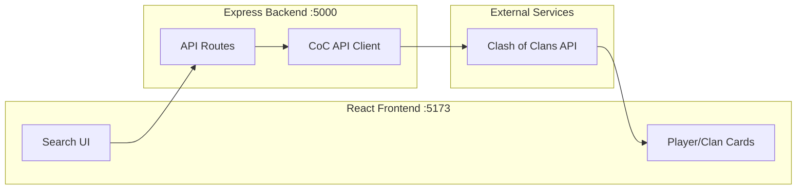

# Clash of Clans Tracker

A full-stack web application that allows users to search and view statistics for Clash of Clans players and clans. The application features a beautiful CoC-inspired dark theme with gold accents.

## Features

- **Player Search**: Look up any player by their tag to view:
  - Town Hall level, trophies, and experience
  - War stars and achievements
  - Clan membership and role
  - Heroes and their levels
  - Donation statistics

- **Clan Search**: Look up any clan by their tag to view:
  - Clan level, points, and war statistics
  - Member count and requirements
  - War frequency and win streak
  - Top members list
  - Clan labels and description

## Architecture

The application follows a secure proxy architecture where the frontend never handles the API token directly.



### Data Flow

1. User enters a player/clan tag in the React frontend
2. Frontend sends request to Express backend (`/api/player/:tag` or `/api/clan/:tag`)
3. Backend middleware encodes the tag and adds authentication headers
4. Request is forwarded to the official Clash of Clans API
5. Response is returned through the backend to the frontend
6. Frontend renders the data in styled cards

## Tech Stack

| Layer | Technology |
|-------|------------|
| Frontend | React 18, Vite 4 |
| Backend | Node.js, Express 4 |
| HTTP Client | Axios (backend), Fetch API (frontend) |
| Styling | CSS3 with CSS Variables |
| Fonts | Google Fonts (Cinzel, Crimson Text) |
| API | Clash of Clans Official API |

## Project Structure

```
clash-of-clans-tracker/
├── client/                     # React + Vite Frontend
│   ├── public/
│   │   └── vite.svg           # App icon
│   ├── src/
│   │   ├── components/
│   │   │   ├── SearchForm.jsx  # Search input with player/clan toggle
│   │   │   ├── SearchForm.css
│   │   │   ├── PlayerCard.jsx  # Player stats display
│   │   │   ├── PlayerCard.css
│   │   │   ├── ClanCard.jsx    # Clan stats display
│   │   │   ├── ClanCard.css
│   │   │   ├── Loader.jsx      # Loading spinner
│   │   │   └── Loader.css
│   │   ├── services/
│   │   │   └── api.js          # API service layer
│   │   ├── App.jsx             # Main application component
│   │   ├── App.css
│   │   ├── index.css           # Global styles & CSS variables
│   │   └── main.jsx            # React entry point
│   ├── index.html
│   ├── vite.config.js          # Vite config with proxy
│   └── package.json
│
├── server/                     # Express Backend
│   ├── routes/
│   │   ├── player.js           # Player API routes
│   │   └── clan.js             # Clan API routes
│   ├── middleware/
│   │   └── cocApi.js           # CoC API client with axios
│   ├── index.js                # Express server entry
│   ├── package.json
│   └── .env                    # API token (not committed)
│
└── README.md
```

## Setup Instructions

### Prerequisites

- Node.js 14.18+ (recommended: 18 LTS or 20 LTS)
- npm 6+
- Clash of Clans API token (get one at [developer.clashofclans.com](https://developer.clashofclans.com))

### 1. Clone the Repository

```bash
git clone <repository-url>
cd clash-of-clans-tracker
```

### 2. Backend Setup

```bash
# Navigate to server directory
cd server

# Install dependencies
npm install

# Create environment file
# Copy .env.example to .env and add your API token
echo COC_API_TOKEN=your_api_token_here > .env

# Start the server
npm run dev
```

The backend will start on `http://localhost:5000`

### 3. Frontend Setup

```bash
# Navigate to client directory (from project root)
cd client

# Install dependencies
npm install

# Start the development server
npm run dev
```

The frontend will start on `http://localhost:5173`

### 4. Access the Application

Open your browser and navigate to `http://localhost:5173`

## API Endpoints

### Backend Routes

| Method | Endpoint | Description |
|--------|----------|-------------|
| GET | `/api/player/:tag` | Fetch player information by tag |
| GET | `/api/clan/:tag` | Fetch clan information by tag |
| GET | `/api/clan/:tag/members` | Fetch clan members by tag |
| GET | `/api/health` | Health check endpoint |

### CoC API Mapping

| Backend Route | CoC API Endpoint |
|---------------|------------------|
| `/api/player/:tag` | `GET /v1/players/{tag}` |
| `/api/clan/:tag` | `GET /v1/clans/{tag}` |
| `/api/clan/:tag/members` | `GET /v1/clans/{tag}/members` |

## Environment Variables

### Server (.env)

| Variable | Description | Required |
|----------|-------------|----------|
| `COC_API_TOKEN` | Your Clash of Clans API token | Yes |
| `PORT` | Server port (default: 5000) | No |

## Design System

### Color Palette

| Color | Variable | Hex |
|-------|----------|-----|
| Background Primary | `--bg-primary` | `#0d0d1a` |
| Background Secondary | `--bg-secondary` | `#1a1a2e` |
| Card Background | `--bg-card` | `#252540` |
| Gold Primary | `--gold-primary` | `#d4af37` |
| Gold Light | `--gold-light` | `#ffd700` |
| Gold Dark | `--gold-dark` | `#b8960c` |
| Text Primary | `--text-primary` | `#f5f5f5` |
| Text Secondary | `--text-secondary` | `#a0a0b0` |

### Typography

- **Display Font**: Cinzel (headings, titles)
- **Body Font**: Crimson Text (content, descriptions)

## Security Notes

- API token is stored server-side only (in `.env`)
- Frontend never has access to the API token
- `.env` file is gitignored and never committed
- CORS is configured to only allow the frontend origin

## Scripts

### Server

| Script | Command | Description |
|--------|---------|-------------|
| `start` | `npm start` | Start production server |
| `dev` | `npm run dev` | Start with auto-reload |

### Client

| Script | Command | Description |
|--------|---------|-------------|
| `dev` | `npm run dev` | Start Vite dev server |
| `build` | `npm run build` | Build for production |
| `preview` | `npm run preview` | Preview production build |

## Disclaimer

This content is not affiliated with, endorsed, sponsored, or specifically approved by Supercell and Supercell is not responsible for it. For more information see [Supercell's Fan Content Policy](https://supercell.com/en/fan-content-policy/).

## License

MIT License

