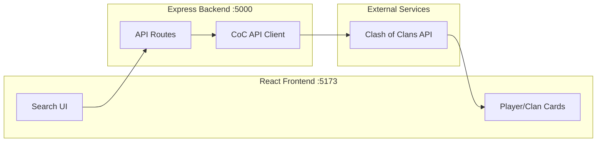

# Clash of Clans Tracker

A full-stack web application that allows users to search and view statistics for Clash of Clans players and clans. The application features a beautiful CoC-inspired dark theme with gold accents, smooth animations, and a fully responsive mobile-friendly design.

## Features

- **Player Search**: Look up any player by their tag to view:
  - Town Hall level, trophies, and experience
  - War stars and achievements
  - Clan membership and role
  - Heroes and their levels
  - Donation statistics

- **Clan Search**: Look up any clan by their tag to view:
  - Clan level, points, and war statistics
  - Member count and requirements
  - War frequency and win streak
  - Top members list
  - Clan labels and description

- **Modern UI/UX**:
  - Responsive design for mobile, tablet, and desktop
  - Smooth animations and micro-interactions
  - CoC-inspired dark theme with gold accents
  - Touch-friendly interface

## Architecture

The application follows a secure proxy architecture where the frontend never handles the API token directly.



### Data Flow

1. User enters a player/clan tag in the React frontend
2. Frontend sends request to Express backend (`/api/player/:tag` or `/api/clan/:tag`)
3. Backend middleware encodes the tag and adds authentication headers
4. Request is forwarded to the official Clash of Clans API
5. Response is returned through the backend to the frontend
6. Frontend renders the data in styled cards

## Tech Stack

| Layer | Technology |
|-------|------------|
| Frontend | React 18, Vite 4 |
| Backend | Node.js, Express 4 |
| HTTP Client | Axios (backend), Fetch API (frontend) |
| Styling | CSS3 with CSS Variables, Animations |
| Fonts | Google Fonts (Cinzel, Crimson Text) |
| API | Clash of Clans Official API |

## Project Structure

```
clash-of-clans-tracker/
├── client/                     # React + Vite Frontend
│   ├── public/
│   │   └── vite.svg           # App icon
│   ├── src/
│   │   ├── components/
│   │   │   ├── SearchForm.jsx  # Search input with player/clan toggle
│   │   │   ├── SearchForm.css
│   │   │   ├── PlayerCard.jsx  # Player stats display
│   │   │   ├── PlayerCard.css
│   │   │   ├── ClanCard.jsx    # Clan stats display
│   │   │   ├── ClanCard.css
│   │   │   ├── Loader.jsx      # Loading spinner
│   │   │   └── Loader.css
│   │   ├── services/
│   │   │   └── api.js          # API service layer
│   │   ├── App.jsx             # Main application component
│   │   ├── App.css
│   │   ├── index.css           # Global styles & CSS variables
│   │   └── main.jsx            # React entry point
│   ├── index.html
│   ├── vite.config.js          # Vite config with proxy
│   └── package.json
│
├── server/                     # Express Backend
│   ├── routes/
│   │   ├── player.js           # Player API routes
│   │   └── clan.js             # Clan API routes
│   ├── middleware/
│   │   └── cocApi.js           # CoC API client with axios
│   ├── index.js                # Express server entry
│   ├── package.json
│   └── .env                    # API token (not committed)
│
└── README.md
```

## Quick Start

### Prerequisites

- **Node.js** 14.18+ (recommended: 18 LTS or 20 LTS) - [Download](https://nodejs.org/)
- **Git** - [Download](https://git-scm.com/downloads)
- **Clash of Clans API token** - [Get one here](https://developer.clashofclans.com)

### 1. Clone the Repository

```bash
git clone https://github.com/TANISHK-RANA/clash-of-clans-tracker.git
cd clash-of-clans-tracker
```

### 2. Install Dependencies

```bash
# Install backend dependencies
cd server
npm install

# Install frontend dependencies
cd ../client
npm install
```

### 3. Configure API Token

Create a `.env` file in the `server/` directory:

```bash
cd ../server
```

**On Windows (PowerShell):**
```powershell
"COC_API_TOKEN=your_api_token_here`nPORT=5000" | Out-File -FilePath .env -Encoding ascii
```

**On Mac/Linux:**
```bash
echo "COC_API_TOKEN=your_api_token_here" > .env
echo "PORT=5000" >> .env
```

> **Important:** Replace `your_api_token_here` with your actual token from [developer.clashofclans.com](https://developer.clashofclans.com). Make sure your current IP address is whitelisted in the API key settings.

### 4. Run the Application

**Option A: Development Mode (Two Terminals)**

Terminal 1 - Backend:
```bash
cd server
npm run dev
```

Terminal 2 - Frontend:
```bash
cd client
npm run dev
```

Open `http://localhost:5173` in your browser.

**Option B: Production Mode (Single Server)**

```bash
# Build the frontend
cd client
npm run build

# Start the combined server
cd ../server
npm run dev
```

Open `http://localhost:5000` in your browser.

## Hosting Locally for Internet Access

Want to share your app with friends? Use **localtunnel** to expose your local server to the internet!

### Step 1: Build and Run in Production Mode

```bash
# Build the frontend
cd client
npm run build

# Start the server
cd ../server
npm run dev
```

### Step 2: Create a Tunnel (New Terminal)

```bash
npx localtunnel --port 5000
```

You'll get a public URL like `https://bright-fish-42.loca.lt`

### Step 3: Share the URL!

Give the URL to anyone - they can access your Clash of Clans Tracker from anywhere in the world!

> **Notes:**
> - Keep both terminals running to keep the app accessible
> - The URL changes each time you restart localtunnel
> - First-time visitors will see a "Click to Continue" splash page (normal behavior)

## API Endpoints

### Backend Routes

| Method | Endpoint | Description |
|--------|----------|-------------|
| GET | `/api/player/:tag` | Fetch player information by tag |
| GET | `/api/clan/:tag` | Fetch clan information by tag |
| GET | `/api/clan/:tag/members` | Fetch clan members by tag |
| GET | `/api/health` | Health check endpoint |

### CoC API Mapping

| Backend Route | CoC API Endpoint |
|---------------|------------------|
| `/api/player/:tag` | `GET /v1/players/{tag}` |
| `/api/clan/:tag` | `GET /v1/clans/{tag}` |
| `/api/clan/:tag/members` | `GET /v1/clans/{tag}/members` |

## Environment Variables

### Server (.env)

| Variable | Description | Required |
|----------|-------------|----------|
| `COC_API_TOKEN` | Your Clash of Clans API token | Yes |
| `PORT` | Server port (default: 5000) | No |

## Troubleshooting

### "Failed to fetch player/clan data"

1. **Check your API token** - Make sure `.env` file exists in `server/` folder with your token
2. **Verify IP whitelist** - Your current IP must be whitelisted at [developer.clashofclans.com](https://developer.clashofclans.com)
3. **Restart the server** - Changes to `.env` require a server restart

### "Token not loading" / ".env file is empty"

1. Ensure `.env` is in the `server/` folder (not project root or client folder)
2. No spaces around `=` sign: `COC_API_TOKEN=xxx` ✅
3. No quotes around the token value
4. Try recreating the file using command line (see Quick Start section)

### "localtunnel not found"

If you get an npm error, try:
```bash
# Create npm folder if missing (Windows)
mkdir %APPDATA%\npm

# Or run from project directory
cd clash-of-clans-tracker
npx localtunnel --port 5000
```

### "Port already in use"

```bash
# Find and kill process on port 5000 (Windows PowerShell)
Get-Process -Id (Get-NetTCPConnection -LocalPort 5000).OwningProcess | Stop-Process -Force

# Mac/Linux
lsof -ti:5000 | xargs kill -9
```

## Design System

### Color Palette

| Color | Variable | Hex |
|-------|----------|-----|
| Background Primary | `--bg-primary` | `#0d0d1a` |
| Background Secondary | `--bg-secondary` | `#1a1a2e` |
| Card Background | `--bg-card` | `#252540` |
| Gold Primary | `--gold-primary` | `#d4af37` |
| Gold Light | `--gold-light` | `#ffd700` |
| Gold Dark | `--gold-dark` | `#b8960c` |
| Text Primary | `--text-primary` | `#f5f5f5` |
| Text Secondary | `--text-secondary` | `#a0a0b0` |

### Typography

- **Display Font**: Cinzel (headings, titles)
- **Body Font**: Crimson Text (content, descriptions)

### Responsive Breakpoints

| Device | Width |
|--------|-------|
| Mobile | < 480px |
| Tablet | 481px - 768px |
| Desktop | > 768px |

## Security Notes

- API token is stored server-side only (in `.env`)
- Frontend never has access to the API token
- `.env` file is gitignored and never committed
- CORS is configured to allow frontend origins

## Scripts

### Server

| Script | Command | Description |
|--------|---------|-------------|
| `start` | `npm start` | Start production server |
| `dev` | `npm run dev` | Start development server |

### Client

| Script | Command | Description |
|--------|---------|-------------|
| `dev` | `npm run dev` | Start Vite dev server |
| `build` | `npm run build` | Build for production |
| `preview` | `npm run preview` | Preview production build |

## Disclaimer

This content is not affiliated with, endorsed, sponsored, or specifically approved by Supercell and Supercell is not responsible for it. For more information see [Supercell's Fan Content Policy](https://supercell.com/en/fan-content-policy/).

## License

MIT License
